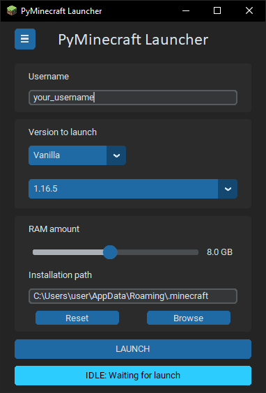

# PyMinecraft Launcher
A GUI wrapper for [mindstorm38](https://github.com/mindstorm38)'s [portablemc](https://github.com/mindstorm38/portablemc) using [CustomTkinter](https://github.com/TomSchimansky/CustomTkinter)

 

## Disclaimer: This is not an actual minecraft launcher
The game itself is launched by [portablemc](https://github.com/mindstorm38/portablemc) (which is an awesome CLI tool to launch minecraft). 
PyMinecraft Launcher only wraps it by providing a GUI to easily use it without having to use the console.

## Calvonetta Laucnher
The standalone installer includes meme "Calvonetta launcher" installation mode. 
This changes the name of the app and swaps the icon with a bald head icon.

## Disclaimer 2: This is not a serious project
It is just a for-fun project I made to make portablemc more accessible to non-tech-savvy people while I learn customtkinter. 
It is not production ready software, neither is it meant to be a serious/formal application. 
It contains memes and easter eggs (Such as the alternative installation mode "Calvonetta Launcher").

## The Modpack launch mode functionality
PyMinecraft isn't able to install CurseForge or Modrinth modpacks (I'll leave that to more serious project, such as [Prism Launcher](https://github.com/Akascape/CTkScrollableDropdown)).
Instead, I have developed my own modpack distribution system using git & github (much simpler than the one used by the above mentioned platforms).
Again, it is not meant to replace said services, but rather a Q&D solution to distribute my own modpacks.
Modpacks are published [here](https://github.com/CalvonettaModpacks)

## Usage / Instalation
You can use the app by cloning the repo and executing main.py I use python 3.12, but it should work for 3.9 onward (the same as portablemc)
I also compile each new release to a standalone installer with [PyInstaller](https://github.com/pyinstaller/pyinstaller) and [Inno Setup](https://jrsoftware.org/isinfo.php) (Windows only!)

## Dependencies (credits): 
[portablemc](https://github.com/mindstorm38/portablemc) Actual launcher behind this app

[CustomTkinter](https://github.com/TomSchimansky/CustomTkinter) Custom tkinter prefabs that actually look good!

[CTkScrollableDropdown](https://github.com/Akascape/CTkScrollableDropdown) Dropdown menu with scroll bar

[PyInstaller](https://github.com/pyinstaller/pyinstaller) Compiling python scripts to binaries

[Inno Setup](https://jrsoftware.org/isinfo.php) Packing binaries to comfortable installers